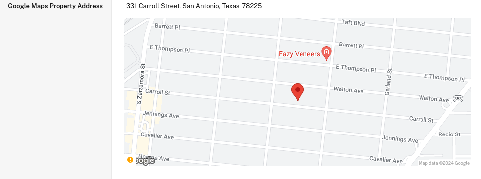

Desenvolvi um sistema de agregação de leads para uma empresa imobiliária na Flórida, como parte de um projeto freelance. Este sistema coleta e centraliza informações de diversos sites de imóveis, fornecendo dados atualizados em tempo real na plataforma Podio, utilizada pela equipe de vendas para prospecção de oportunidades.

<!--more-->

## Funcionalidades Principais

1. **Monitoramento e Coleta de Dados**:
   - Identifica novas listagens de propriedades em múltiplos sites.
   - Captura informações detalhadas, incluindo endereço, preço, dados demográficos, características do imóvel e mais.
   - Atualiza automaticamente informações de propriedades já registradas.

2. **Automações na Plataforma Podio**:
   - Atualização automática do status das listagens conforme avaliação dos funcionários.
   - Registro automático de data e hora das avaliações.
   - Conversão de endereços em coordenadas geográficas (latitude e longitude).
   - Integração do histórico de comunicações com clientes em cada listagem.

## Tecnologias Utilizadas

- Podio (Plataforma de gerenciamento de leads)
- Node.js (Ambiente de execução)
- Puppeteer (Web scraping e automação)
- JSDOM (Parsing de HTML)
- APIs diversas

## Desafios e Soluções

#### 1. Operação Contínua e Confiável
**Desafio**: Criar um sistema que opere ininterruptamente, garantindo a integridade dos dados.
**Solução**: Implementação de um robusto sistema de tratamento de erros, assegurando a continuidade operacional e a preservação de dados mesmo em caso de falhas na plataforma.

#### 2. Coleta de Dados em Sites Diversos
**Desafio**: Extrair dados de sites com estruturas variadas e em constante mudança, muitos sem APIs documentadas.
**Solução**: Desenvolvimento de uma base de código flexível e de fácil manutenção, utilizando abordagens resilientes para adaptação a mudanças nas estruturas dos sites.

## Impacto e Resultados

Este sistema revolucionou o processo de prospecção da empresa, oferecendo:
- Acesso rápido a leads atualizados em tempo real.
- Aumento significativo na eficiência da equipe de vendas.
- Melhoria na qualidade e precisão dos dados utilizados para tomada de decisões.

## Conclusão

Este projeto demonstra minha capacidade de desenvolver soluções robustas e escaláveis, integrando diversas tecnologias para criar um sistema que agrega valor real ao negócio do cliente. A experiência adquirida reforçou minhas habilidades em web scraping, automação de processos e integração de sistemas, além de aprimorar minha capacidade de resolver problemas complexos de forma eficiente.
