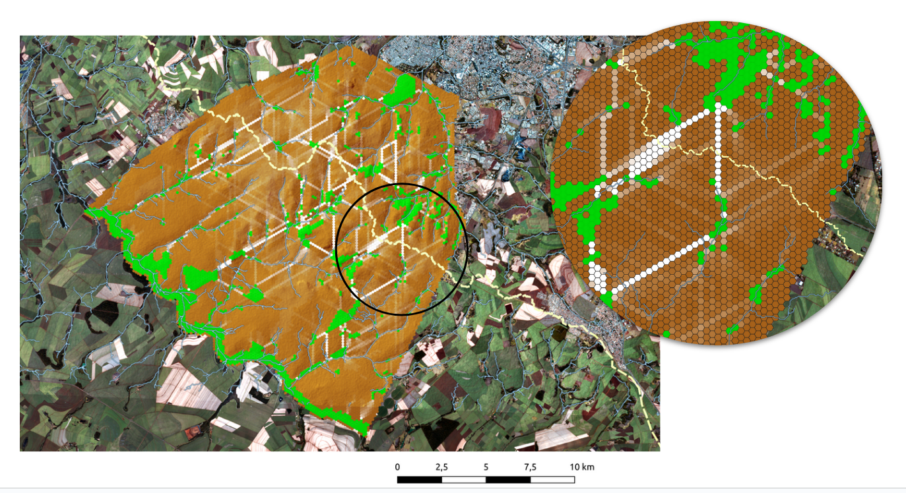

# 

## Visão Geral do Projeto

Este projeto teve como objetivo avaliar e otimizar a conectividade ecológica entre fragmentos florestais na região de Ribeirão Preto, São Paulo. Utilizamos técnicas avançadas de processamento de imagens de satélite, aprendizado de máquina e teoria de grafos para identificar áreas prioritárias para restauração ambiental.

<!--more-->

## Tecnologias Utilizadas

- **Linguagem de Programação:** R
- **Bibliotecas:** Random Forest, pacotes para manipulação de grafos
- **Software GIS:** QGIS (versão 3.28.6)
- **Dados de Satélite:** Sentinel-2

## Metodologia

1. **Classificação de Cobertura do Solo:**
   - Utilizamos imagens do satélite Sentinel-2
   - Implementamos um algoritmo de Random Forest no R para classificar diferentes tipos de cobertura do solo

   
   *Figura 1: Classificação da cobertura do solo feita através do pacote Random Forest*

2. **Criação de Grid Hexagonal:**
   - Desenvolvemos um script para criar um grid hexagonal sobre a área de estudo
   - Calculamos a porcentagem de mata nativa em cada hexágono

   
   *Figura 2: Grid com hexágonos de 150 m de diâmetro contendo a porcentagem de vegetação nativa*

3. **Análise de Grafos:**
   - Modelamos a paisagem como um grafo, onde cada hexágono é um nó
   - Implementamos um algoritmo para calcular o peso das arestas baseado na cobertura florestal
   - Aplicamos a métrica de centralidade (betweenness centrality) para identificar caminhos preferenciais na paisagem

   
   *Figura 3: Resultado do algoritmo de intermediação (centralidade)*

4. **Visualização de Resultados:**
   - Utilizamos QGIS para criar mapas detalhados dos resultados da análise

   
   *Figura 4: Mapa final*

## Desafios Técnicos

- Processamento de grandes volumes de dados de satélite
- Otimização de algoritmos para lidar com a complexidade computacional da análise de grafos em larga escala
- Integração de diferentes fontes de dados (imagens de satélite, dados vetoriais do CAR, etc.)

## Resultados

O projeto resultou em um mapa detalhado mostrando áreas prioritárias para restauração, baseado na análise de conectividade. Identificamos 105,82 km de corredores potenciais que poderiam significativamente melhorar a conectividade ecológica na região.

## Impacto e Aplicações Futuras

Esta abordagem computacional para análise de paisagens tem diversas aplicações potenciais em ecologia e conservação. O método pode ser adaptado para outras regiões e escalas, oferecendo uma ferramenta poderosa para tomada de decisões em projetos de restauração ambiental.

## Conclusão

Este projeto demonstra como técnicas avançadas de programação e análise de dados podem ser aplicadas a problemas complexos de conservação ambiental. A combinação de aprendizado de máquina, análise de grafos e sistemas de informação geográfica oferece uma nova perspectiva para abordar desafios ecológicos.
