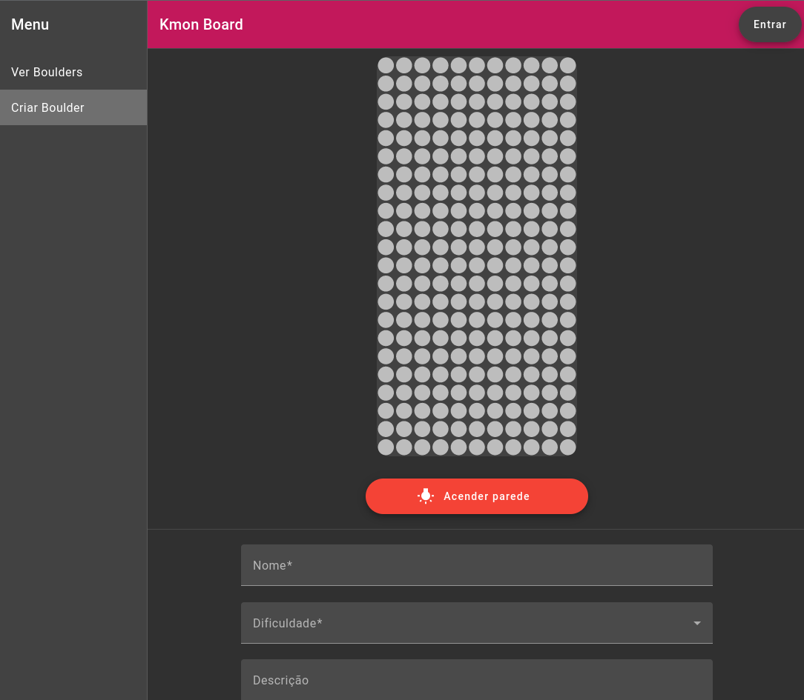

Inspirado em produtos similares no mercado, criei uma solução mais acessível e dinâmica, que possibilita que academias de escalada aproveitem a estrutura existente para criar uma experiência interativa onde os escaladores podem criar e compartilhar infinitos problemas de boulder na mesma parede.

<!--more-->

### **Características Principais**
- **Painel Interativo LED:** Uma parede de escalada equipada com LEDs controlados individualmente, que iluminam as agarras para cada problema de boulder.

- **Criação de Problemas Personalizados:** Os usuários podem criar seus próprios problemas de boulder por meio de uma interface intuitiva no smartphone.

- **Biblioteca de Problemas:** Uma coleção crescente de problemas criados pela comunidade, classificados por dificuldade e criador.

- **Atualização em Tempo Real:** Os problemas são atualizados instantaneamente na parede, graças à comunicação em tempo real entre o servidor e o hardware.

### **Tecnologias Utilizadas**

- **Hardware:** ESP32 como microcontrolador, fita de LED WS2811.

- **Backend:** Servidor Express com WebSockets para comunicação em tempo real, PostgreSQL para armazenamento de dados.

- **Microcontrolador:** ESP32 com firmware customizado desenvolvido em C++.

- **Frontend:** Aplicação web em Angular, otimizada para uso móvel.

- **Comunicação:** API RESTful para gerenciamento de problemas, WebSockets para atualizações em tempo real da placa.

### **Desafios e Soluções**

Um dos principais desafios foi encontrar uma solução que possibilitasse a comunicação em tempo real do microcontrolador com a interface de forma eficiente e de fácil configuração tanto para a academia quanto para os usuários. Ou seja, que não fosse necessário nenhuma configuração na rede da academia, ou que o usuário não precisasse fazer download de nenhum aplicativo.
Este desafio foi superado pela divisão do projeto em três partes: um backend que gerencia toda a funcionalidade de armazenamento de problemas e credenciais para login; a interface, onde os usuários podem criar e gerenciar seus problemas, além de selecionar problemas existentes para serem exibidos na parede; e o microcontrolador, que estabelece uma conexão reversa com o servidor para receber atualizações do estado da fita de LED e exibir animações durante a atualização de estado."

### **Impacto e Futuro**

O LEDge não apenas moderniza a experiência de escalada indoor, mas também cria uma comunidade interativa de escaladores que podem compartilhar e experimentar os desafios uns dos outros. No futuro, planejo expandir o sistema para incluir recursos como competições online, acompanhamento de progresso pessoal e outras funcionalidades.
Este projeto demonstra minha capacidade de combinar hardware, software backend e frontend para criar uma solução completa e inovadora. Estou ansioso para continuar refinando e expandindo o LEDge, potencialmente revolucionando a forma como as pessoas experimentam a escalada indoor.
